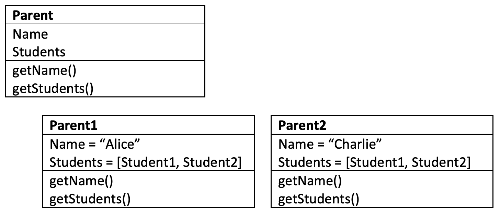
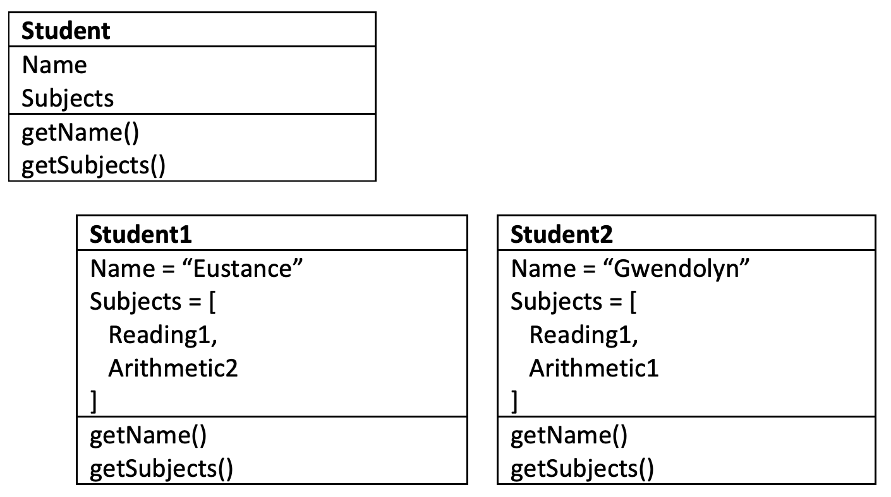
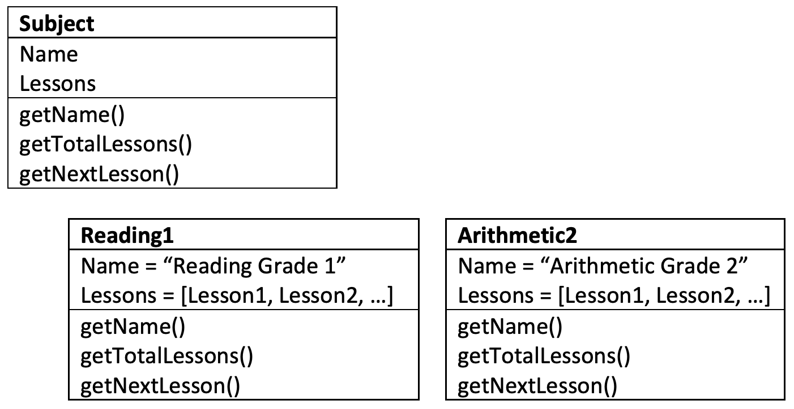
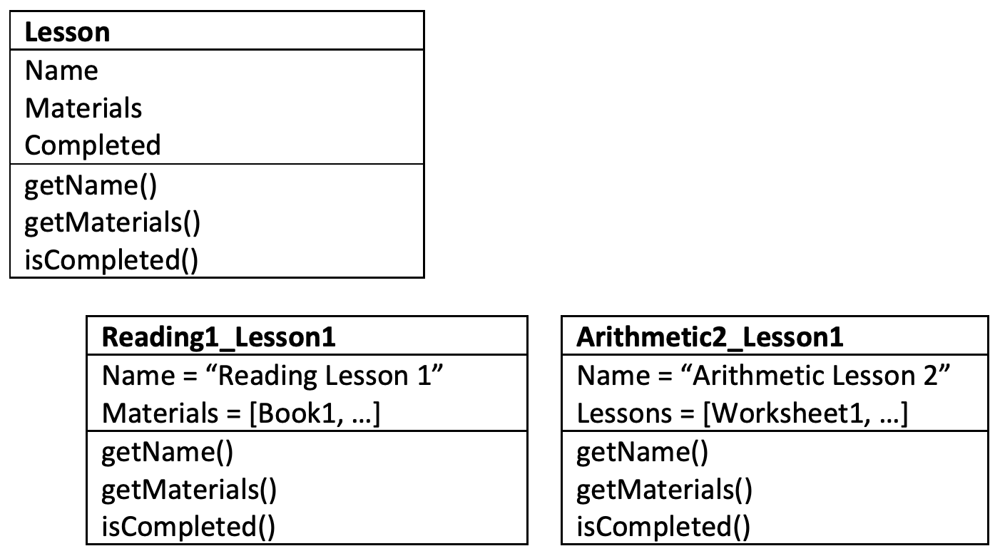
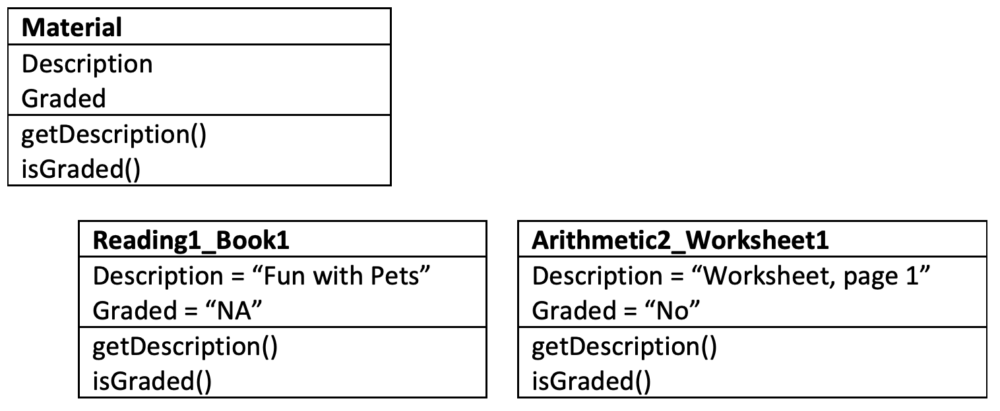

## Class & Object Structure

### Parent
A “Parent” has many “Students.”

### Student
A “Student” has many “Subjects.”

### Subject
A “Subject” has many “Lessons.”

 
### Lesson
A “Lesson” has many “Materials.”

### Material

